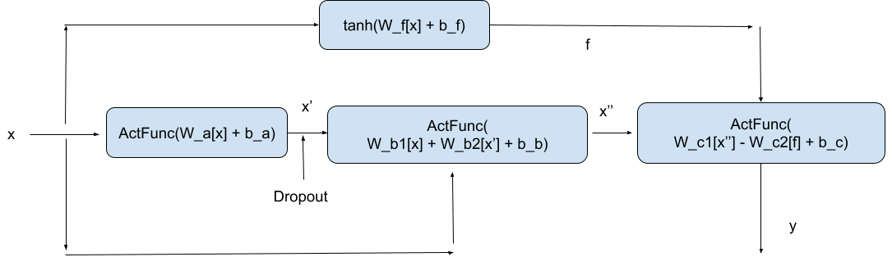

# Ml_debug
Please commit all your code to this repository. You can make a branch or directly commit to main. Please be mindful of your commit messages so the team can have an easier time reviewing!

Use the pyproject.toml file to install required dependencies into your virtual environment.

## Part 1 - Pytorch Function

We want to use our custom ActFunc as an activation function in our network. A team member who is now on vacation implemented this in the `mlfin.functions` module along with ReLu. ReLu is passing the gradient test but our ActFunc fucntion is not. Fix the backwards on ActFunc and make sure that our `tests.test_functions` pytest module passes all tests.

## Part 2 - Model Architecture

Our team member who was on vacation left this network diagram for what was to be implemented for our tests. Can't wait for them to get back, it's up to you!

Go ahead and implement the network architecture in `mlfin.models`.

## Part 3 - Application to data set

We want to apply this model to the miami housing dataset. This is provided by a pytorch dataset class in `mlfin.data`. You can use this dataloader in your training function (which you will need to implement).

We want to run the model on this dataset, plot our performance and then find ways to improve our performance.
